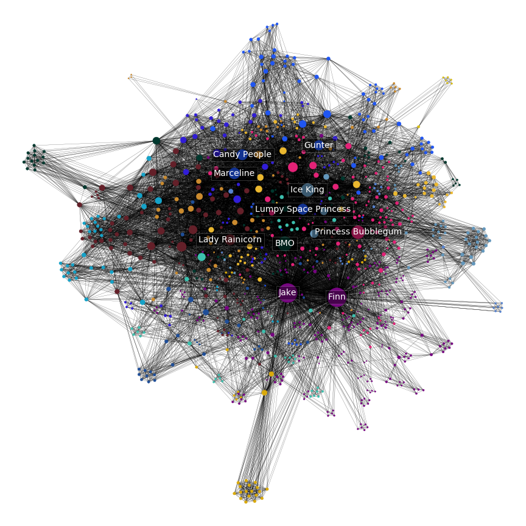
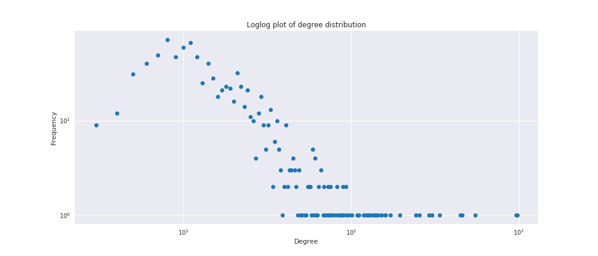
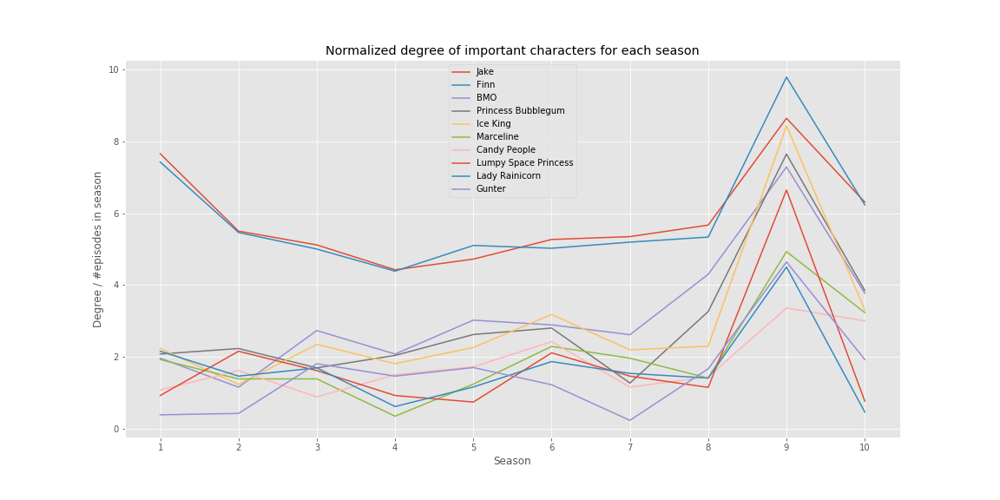

# Introduction

Our project is based on an analysis of the Cartoon Network animated TV-series Adventure Time. The series launched in April 2010 and concluded in September of 2018 with 10 seasons and 283 episodes which on average are about 10 minutes each. We wish to present some questions and hypotheses and try to answer them with network and text analysis.

## Data
We gather a list of characters for each episode from the [Adventure Time Wiki](https://www.adventuretime.fandom.com). This already lead us to some choices about how we wanted to model the analysis. We chose to base it on the characters in each episode for which there are two lists in each episode article: 'Major Characters' and 'Minor Characters' - from what we can see these are ordered in approximate importance for the episode. Because of this the links between characters are made up of combinations of the combined list of major and minor characters since it gives a good indication of which characters are the most important.

The Wiki also provides transcripts for a majority of the episodes. They cut off at around season 8. It seems like no one has had the motivation to transcribe these episodes (future work?). This causes us to only work with episode transcripts from season 1-7. 

### Short summary of data
- 953 characters (nodes)
- 12984 relations (links)
- 225 transcripts (season 1-7)

# Network analysis
We want to verify that the characters we believe are the most important actually are from an analytical point of view.
From the table below, we see to no surprise that Finn and Jake are the main players given their large out-degree and relatively low in-degree. This is a metric of how many episode in which they've had a prominent role.
<table border="0" class="dataframe">  <thead>    <tr style="text-align: center;">      <th></th>      
	<th>Out-degree</th>      <th>In-degree</th>      <th>Total degree</th>    </tr>  </thead>  <tbody>    <tr>      
<th>1</th>      <td>Finn: 832</td>      <td>BMO: 186</td>      <td>Jake: 978</td>    </tr>    <tr>      
<th>2</th>      <td>Jake: 820</td>      <td>Candy People: 173</td>      <td>Finn: 965</td>    </tr>    <tr>      
<th>3</th>      <td>BMO: 363</td>      <td>Jake: 158</td>      <td>BMO: 549</td>    </tr>    <tr>      
<th>4</th>      <td>Princess Bubblegum: 339</td>      <td>Finn: 133</td>      <td>Princess Bubblegum: 461</td>    </tr>    <tr>      
<th>5</th>      <td>Ice King: 320</td>      <td>Lady Rainicorn: 132</td>      <td>Ice King: 448</td>    </tr>    <tr>      
<th>6</th>      <td>Marceline: 237</td>      <td>Ice King: 128</td>      <td>Marceline: 336</td>    </tr>    <tr>      
<th>7</th>      <td>Lumpy Space Princess: 216</td>      <td>Princess Bubblegum: 122</td>      <td>Candy People: 303</td>    </tr>    <tr>      
<th>8</th>      <td>Lady Rainicorn: 158</td>      <td>Gunter: 106</td>      <td>Lumpy Space Princess: 302</td>    </tr>    <tr>      
<th>9</th>      <td>Gunter: 150</td>      <td>Tree Trunks: 105</td>      <td>Lady Rainicorn: 290</td>    </tr>    <tr>      
<th>10</th>     <td>Peppermint Butler: 142</td>      <td>Peppermint Butler: 101</td>      <td>Gunter: 256</td>    </tr>  </tbody></table>

<!--
<table border="0" class="dataframe">  <thead>    <tr style="text-align: center;">      <th></th>      <th>Betweenness</th>      <th>Eigenvector</th>      <th>Degree centrality</th>    </tr>  </thead>  <tbody>    <tr>      
<th>1</th>      <td>Jake: 0.195</td>      <td>Candy People: 0.197</td>      <td>Jake: 1.024</td>    </tr>    <tr>      
<th>2</th>      <td>Finn: 0.148</td>      <td>BMO: 0.148</td>      <td>Finn: 1.01</td>    </tr>    <tr>      
<th>3</th>      <td>BMO: 0.093</td>      <td>Peppermint Butler: 0.14</td>      <td>BMO: 0.575</td>    </tr>    <tr>      
<th>4</th>      <td>Princess Bubblegum: 0.071</td>      <td>Lady Rainicorn: 0.136</td>      <td>Princess Bubblegum: 0.483</td>    </tr>    <tr>      
<th>5</th>      <td>Ice King: 0.069</td>      <td>Ice King: 0.134</td>      <td>Ice King: 0.469</td>    </tr>    <tr>      
<th>6</th>      <td>Lady Rainicorn: 0.049</td>      <td>Tree Trunks: 0.131</td>      <td>Marceline: 0.352</td>    </tr>    <tr>      
<th>7</th>      <td>Candy People: 0.045</td>      <td>Jake: 0.127</td>      <td>Candy People: 0.317</td>    </tr>    <tr>      
<th>8</th>      <td>Lumpy Space Princess: 0.04</td>      <td>Princess Bubblegum: 0.126</td>      <td>Lumpy Space Princess: 0.316</td>    </tr>    <tr>      
<th>9</th>      <td>Tree Trunks: 0.033</td>      <td>Mr. Pig: 0.124</td>      <td>Lady Rainicorn: 0.304</td>    </tr>    <tr>      
<th>10</th>     <td>Gunter: 0.032</td>      <td>Wyatt: 0.12</td>      <td>Gunter: 0.268</td>    </tr>  </tbody></table>
-->

There are clusters floating on their own away from the central part of the network. These represent episodes in which there are a lot of characters that are never seen again or only appear in episodes with each other. An example of this is the episode [City of Thieves](https://adventuretime.fandom.com/wiki/City_of_Thieves_(episode)) in which Finn and Jake travel to a city where everyone is a thief. These thief characters are never used again and are therefore only interconnected forming a cluster.
<!---->
<iframe src="network.html" width = "1000" height = "750" frameborder="0"></iframe>

To get a sense of what kind of network we are dealing with we look at the degree distribution. We cab infer the type of network from our loglog plot of the network which seems to follow a poissonian distribution indicating a random network.

Considering the degree of the characters throughout the entire series we see that Finn and Jake actually take a dip at around season 4-5. This is perhaps caused by the writers wanting to build up more characters and flesh those out such that they have more pieces to play with for plot. The lore of the show also becomes a much more integral part of the show from around season 4-5, so it would make sense to introduce and build characters around there.

# Text analysis
