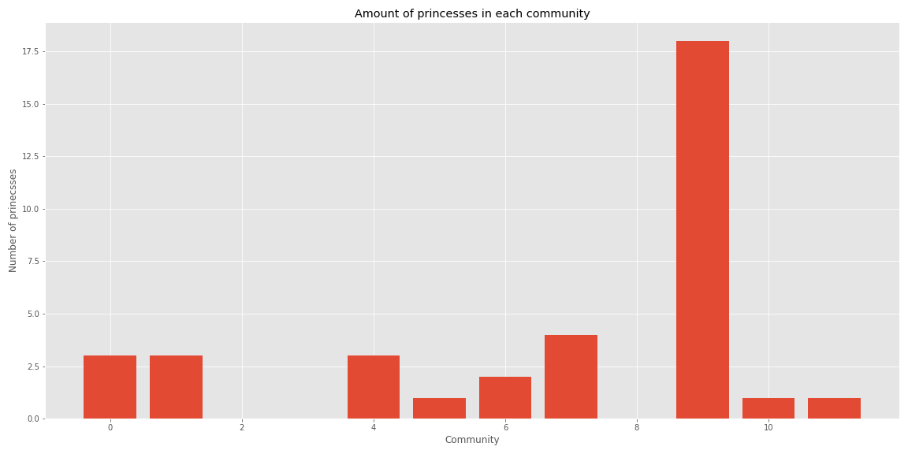
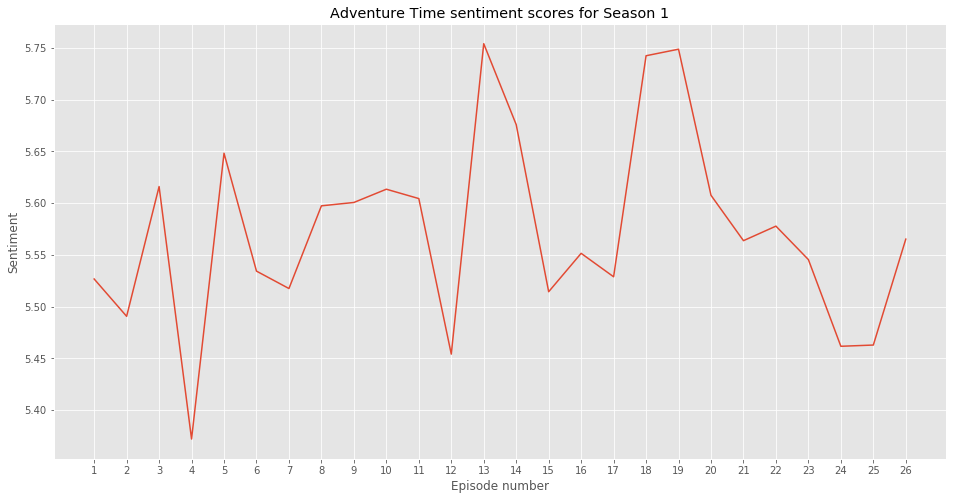
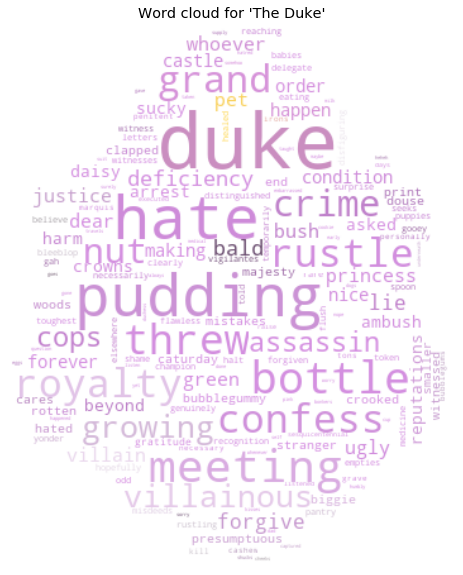
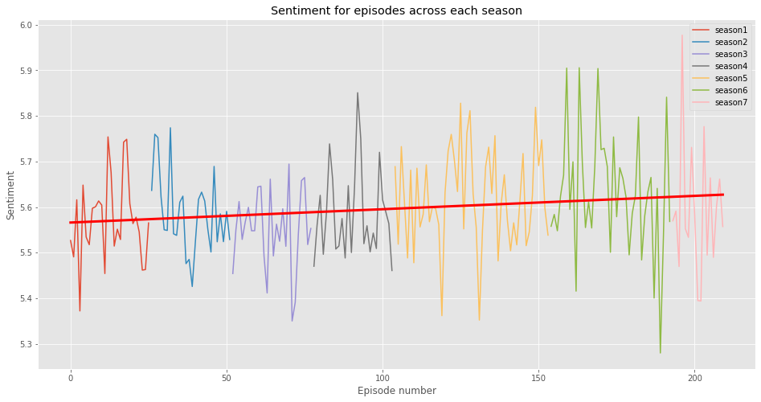
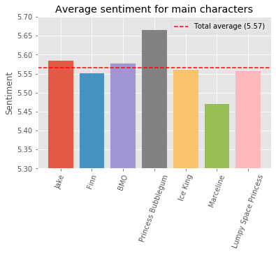
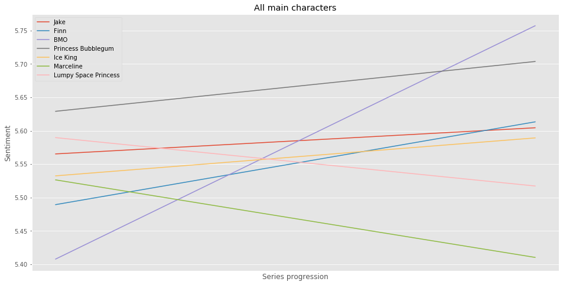
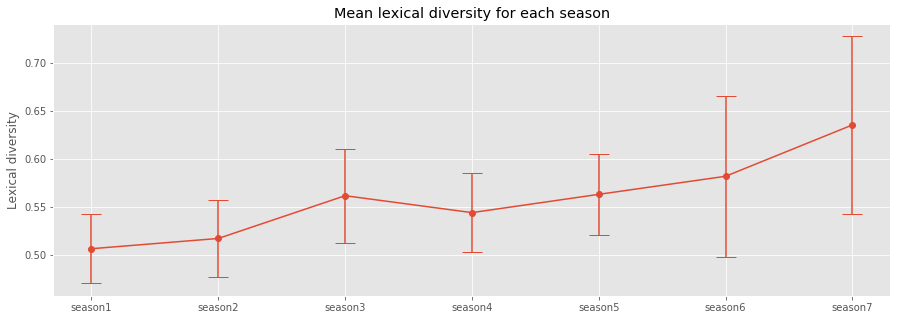

# Introduction

Our project is based on an analysis of the Cartoon Network animated TV-series Adventure Time. The series launched in April 2010 and concluded in September of 2018 with 10 seasons and 283 episodes which on average are about 10 minutes each. We wish to present some questions and hypotheses and try to answer them with network and text analysis.

## Data
We gather a list of characters for each episode from the [Adventure Time Wiki](https://www.adventuretime.fandom.com). This already lead us to some choices about how we wanted to model the analysis. We chose to base it on the characters in each episode for which there are two lists in each episode article: 'Major Characters' and 'Minor Characters' - from what we can see these are ordered in approximate importance for the episode. Because of this the links between characters are made up of combinations of the combined list of major and minor characters since it gives a good indication of which characters are the most important.

The Wiki also provides transcripts for a majority of the episodes. They cut off at around season 8. It seems like no one has had the motivation to transcribe these episodes (future work?). This causes us to only work with episode transcripts from season 1-7. 

### Short summary of data
- 953 characters (nodes)
- 12984 relations (links)
- 225 transcripts (season 1-7)

# Network analysis
## Network exploration
We want to verify that the characters we believe are the most important actually are from an analytical point of view.
From the table below, we see to no surprise that Finn and Jake are the main players given their large out-degree and relatively low in-degree. This is a metric of how many episode in which they've had a prominent role.
<table border="0" class="dataframe">  <thead>    <tr style="text-align: center;">      <th></th>      
	<th>Out-degree</th>      <th>In-degree</th>      <th>Total degree</th>    </tr>  </thead>  <tbody>    <tr>      
<th>1</th>      <td>Finn: 832</td>      <td>BMO: 186</td>      <td>Jake: 978</td>    </tr>    <tr>      
<th>2</th>      <td>Jake: 820</td>      <td>Candy People: 173</td>      <td>Finn: 965</td>    </tr>    <tr>      
<th>3</th>      <td>BMO: 363</td>      <td>Jake: 158</td>      <td>BMO: 549</td>    </tr>    <tr>      
<th>4</th>      <td>Princess Bubblegum: 339</td>      <td>Finn: 133</td>      <td>Princess Bubblegum: 461</td>    </tr>    <tr>      
<th>5</th>      <td>Ice King: 320</td>      <td>Lady Rainicorn: 132</td>      <td>Ice King: 448</td>    </tr>    <tr>      
<th>6</th>      <td>Marceline: 237</td>      <td>Ice King: 128</td>      <td>Marceline: 336</td>    </tr>    <tr>      
<th>7</th>      <td>Lumpy Space Princess: 216</td>      <td>Princess Bubblegum: 122</td>      <td>Candy People: 303</td>    </tr>    <tr>      
<th>8</th>      <td>Lady Rainicorn: 158</td>      <td>Gunter: 106</td>      <td>Lumpy Space Princess: 302</td>    </tr>    <tr>      
<th>9</th>      <td>Gunter: 150</td>      <td>Tree Trunks: 105</td>      <td>Lady Rainicorn: 290</td>    </tr>    <tr>      
<th>10</th>     <td>Peppermint Butler: 142</td>      <td>Peppermint Butler: 101</td>      <td>Gunter: 256</td>    </tr>  </tbody></table>

<!--
<table border="0" class="dataframe">  <thead>    <tr style="text-align: center;">      <th></th>      <th>Betweenness</th>      <th>Eigenvector</th>      <th>Degree centrality</th>    </tr>  </thead>  <tbody>    <tr>      
<th>1</th>      <td>Jake: 0.195</td>      <td>Candy People: 0.197</td>      <td>Jake: 1.024</td>    </tr>    <tr>      
<th>2</th>      <td>Finn: 0.148</td>      <td>BMO: 0.148</td>      <td>Finn: 1.01</td>    </tr>    <tr>      
<th>3</th>      <td>BMO: 0.093</td>      <td>Peppermint Butler: 0.14</td>      <td>BMO: 0.575</td>    </tr>    <tr>      
<th>4</th>      <td>Princess Bubblegum: 0.071</td>      <td>Lady Rainicorn: 0.136</td>      <td>Princess Bubblegum: 0.483</td>    </tr>    <tr>      
<th>5</th>      <td>Ice King: 0.069</td>      <td>Ice King: 0.134</td>      <td>Ice King: 0.469</td>    </tr>    <tr>      
<th>6</th>      <td>Lady Rainicorn: 0.049</td>      <td>Tree Trunks: 0.131</td>      <td>Marceline: 0.352</td>    </tr>    <tr>      
<th>7</th>      <td>Candy People: 0.045</td>      <td>Jake: 0.127</td>      <td>Candy People: 0.317</td>    </tr>    <tr>      
<th>8</th>      <td>Lumpy Space Princess: 0.04</td>      <td>Princess Bubblegum: 0.126</td>      <td>Lumpy Space Princess: 0.316</td>    </tr>    <tr>      
<th>9</th>      <td>Tree Trunks: 0.033</td>      <td>Mr. Pig: 0.124</td>      <td>Lady Rainicorn: 0.304</td>    </tr>    <tr>      
<th>10</th>     <td>Gunter: 0.032</td>      <td>Wyatt: 0.12</td>      <td>Gunter: 0.268</td>    </tr>  </tbody></table>
-->

There are clusters floating on their own away from the central part of the network. These represent episodes in which there are a lot of characters that are never seen again or only appear in episodes with each other. An example of this is the episode [City of Thieves](https://adventuretime.fandom.com/wiki/City_of_Thieves_(episode)) in which Finn and Jake travel to a city where everyone is a thief. These thief characters are never used again and are therefore only interconnected forming a cluster.
<!---->
<iframe src="network.html" width = "1000" height = "750" frameborder="0"></iframe>

## Degree distribution
To get a sense of what kind of network we are dealing with we look at the degree distribution. We cab infer the type of network from our loglog plot of the network which seems to follow a poissonian distribution indicating a random network.

Considering the degree of the characters throughout the entire series we see that Finn and Jake actually take a dip at around season 4-5. This is perhaps caused by the writers wanting to build up more characters and flesh those out such that they have more pieces to play with for plot. The lore of the show also becomes a much more integral part of the show from around season this time, so it would make sense to introduce and build characters around there.

The notisable spike in season 9 is likely caused by the show focusing on serialised episode with a heavy reliance on "mini-series" where the same characters are sure to be present in a few episodes while interacting with a bunch of new characters.

## Community detection

Since there aren't any predefined communities in Adventure Time we have to be creative. This caused us to think about a group of characters with something very particular in common. The abundance of princesses in the show who each governs their respective kingdom. Do they form a community even though they don't necessarily interact all that much? 

To find out we use the Louvain community detection algorithm to find that, yes, there seems to be potential for a community. We plot the distribution of princesses in respect to their assigned community and find that there most certainly is a community present. 

# Text analysis

Adventure Time is known to most people as a generally fun and joyful show but we wanted to dig deeper into this belief and examine what exactly made this show so happy (apart from the funny voices and vibrant colour scheme). We were also interested to see how the sentiment of the show progressed over time with the initial hypothesis that as the show becomes more complex and the stakes grow higher, the positivity of the episodes will decrease. We were also interested in analysing the sentiment on a character-by-character base to see which characters have a positive impact on the overall sentiment of the show and which have a negative impact. Lastly, we looked at lexical diversity across seasons. 

## Episode sentiment

First, we calculated the sentiment for each episode in each season using the LabMT wordlist. Here we see the result for Season 1. There are some big spikes in sentiments but most episodes lie within a range of 5.45 to 5.65. The episode with the lowest score in this season is [The Duke](https://adventuretime.fandom.com/wiki/The_Duke) with a sentiment of 5.37 and the episode with the highest score is [Wizard](https://adventuretime.fandom.com/wiki/Wizard_(episode)) with a sentiment of 5.75. 

We wanted to see more specifically why these two episodes were respectively the most negative and positive episodes of the season. To do this, we created word clouds for each of them using the TF-IDF of each word in the episode. For [The Duke](https://adventuretime.fandom.com/wiki/The_Duke) we do see that generally negative words such as ‘hate’, ‘crime’, ‘assassin’ and ‘villainous’ are very defining words of the episode, leading us to believe that this is in fact one of the more negative episodes. Looking at the word cloud for [Wizard](https://adventuretime.fandom.com/wiki/Wizard_(episode)) we see some much more positive words such as ‘star’, ‘power’ and ‘magic’, so this is indeed clearly a positive episode. 

 

We now wanted to get a broader perspective of the series as a whole so we calculated the sentiment for each transcribed episode from Season 1 to 7 and added a trendline. First of all, we see that the overall sentiment of the show actually increases with time, which contradicts our initial hypothesis. The most positive season is Season 6 with a mean sentiment of 5.63 and the most negative is Season 3 with a mean sentiment of 5.55. However the sentiments of the episodes in the later seasons vary much more than those of the earlier seasons. The standard deviations of the mean sentiment scores for Season 6 and 7 are 0.13 and 0.14, respectively, while those for Season 2 and Season 3 are both only 0.09. This means that the episodes in the earlier seasons were generally equally negative while in the later seasons they are generally more positive but only because there are both very negative and very positive episodes, the latter slightly outweighing the negative. 

This theory is backed by the fact that both the overall most positive and most negative episodes of the show happen in the later seasons. The episode with the lowest sentiment score is [On the Lam](https://adventuretime.fandom.com/wiki/On_the_Lam) in Season 6 with a score of 5.28 and the episode with the highest sentiment is [Football](https://adventuretime.fandom.com/wiki/Football_(episode)) in Season 7 with a score of 5.98. 

## Character development

The change in sentiment across any tv-show can usually be ascribed to the individual changes in the most important characters, and Adventure Time should be no different. Based on our network analysis, the top 10 most important characters in Adventure Time are Jake, Finn, BMO, Princess Bubblegum, Ice King, Marceline, Candy People, Lumpy Space Princess, Lady Rainicorn and Gunter, so these are the characters we will be examining on an individual basis. However, Candy People, Lady Rainicorn and Gunter barely ever speak so these have been left out of this part of the analysis. 

Again we used sentiment analysis on an episode-by-episode basis, this time filtered by the character speaking which specific lines. We see that the average sentiment for the most important characters is 5.57 across the entire series. The main characters Finn and Jake both have pretty average sentiments with Finn’s being a bit below the average (5.55) and Jake’s being a bit above (5.58). Princess Bubblegum is the character with the highest average sentiment and Marceline is the character with the lowest, something that fits very clearly with each character’s aesthetic. 

No character is static, though, and from series beginning to series end we do see that the sentiment of each character changes. Both of the main characters Finn and Jake have a positive development across the entire series. However, while Finn starts the show 0.08 lower than Jake, his sentiment score actually ends up surpassing that of Jake. This tells us that out of the two main characters, Jake is much more solid and does not change much while Finn spends the show going through a lot of positive character development. 

BMO has the most impressive development, going from the most negative to the most positive character across the series. The only characters that develop in a negative direction are Lumpy Space Princess and Marceline, both ending up as the most negative characters by the end of the show. Although some characters do have negative evolutions they get outweighed by the positive evolutions of the other main characters, leading to the general positive development across the entire show that we saw before.

## Lexical diversity

Another indication of maturity could be the lexical diversity, meaning the amount of unique words in an episode or a season divided by the total amount of words. As we see, the lexical diversity does indeed increase with time meaning that as the viewers of the show grew older, the amount of unique words (and thereby the complexity of the language used) increased. 

