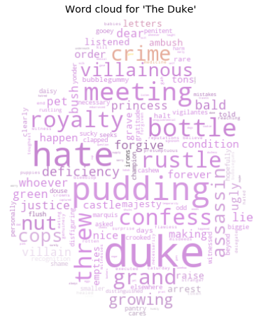
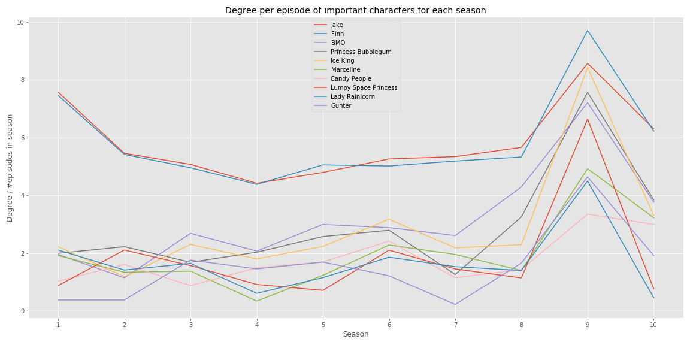

# Introduction

Adventure Time is an American fantasy animated television series following the adventures of a boy named Finn the Human and his best friend and adoptive brother Jake the Dog. The show ran from April of 2010 until September of 2018, airing 283 episodes across 10 seasons where each episode is about 10 minutes long. The show started out as being mainly a children’s program but after it became a viral hit on the internet, many teens and grown-ups also started watching. As older fans of the show ourselves, we wanted to use this project to examine whether it is possible to determine that Adventure Time matures together with its audience. 

## Data
The sheer amount of episodes and characters makes this an incredibly interesting subject for network science and text analysis. We got all of our data from [The Adventure Time Wiki](https://www.adventuretime.fandom.com) which has pages for each episode containing lists of major and minor characters together with episode transcripts. There is a severe lack of transcripts for episodes in Season 8-10 so for the text analysis part of this project we only analysed episodes from Season 1-7. If we summarise every character and relation (a relation between two characters meaning that they appeared in the same episode), we now have a dataset consisting of 
- 953 characters 
- 12,984 relations
- 225 transcripts (Season 1-7)

## Project questions
In order to determine whether Adventure Time becomes more and more mature as the show progresses, we wanted to examine the development in the emotional value (sentiment) of the words used for each episode. Our hypothesis was that the show would get more serious with time and that the sentiment would lower. We also wanted to look at the diversity of words used; an increasing lexical diversity across seasons could very well indicate that the show is becoming more mature with time. 

We also wanted to look at the sentiment for the individual characters but for this we first needed to find out which out of the 953 characters to focus on. Our hypothesis was that Finn and Jake were by far the most important characters to the show, seeing as these are usually labeled as the main characters. Other important characters could include Princess Bubblegum, Ice King, BMO, and more. We also wanted to see if there were any interesting communities between the characters -- perhaps a community of princesses? 

With this we were now able to calculate the sentiment on an individual level. We were interested to see which characters contributed to the series getting more positive/negative and why. Our hypothesis was that Finn and Jake would change the least over the course of the series seeing as these are the main characters and have to stay more or less consistent. The farther away from being a main character, the more the character would change. 

# Seasonal overview
Adventure Time is known to most people as a generally fun and joyful show but we wanted to dig deeper into this belief and examine what exactly made this show so happy (apart from the funny voices and vibrant colour scheme). We were also interested to see how the sentiment of the show progressed over time with the initial hypothesis that as the show becomes more complex and the stakes grow higher, the positivity of the episodes will decrease. We were also interested in analysing the sentiment on a character-by-character base to see which characters have a positive impact on the overall sentiment of the show and which have a negative impact. Lastly, we looked at lexical diversity across seasons. 

## Episode sentiment

First, we calculated the sentiment for each episode in each season using the LabMT wordlist. Here we see the result for Season 1. There are some big spikes in sentiments but most episodes lie within a range of 5.45 to 5.65. The episode with the lowest score in this season is [The Duke](https://adventuretime.fandom.com/wiki/The_Duke) with a sentiment of 5.37 and the episode with the highest score is [Wizard](https://adventuretime.fandom.com/wiki/Wizard_(episode)) with a sentiment of 5.75. 

We wanted to see more specifically why these two episodes were respectively the most negative and positive episodes of the season. To do this, we created word clouds for each of them. For [The Duke](https://adventuretime.fandom.com/wiki/The_Duke) we do see that generally negative words such as ‘hate’, ‘crime’, ‘assassin’ and ‘villainous’ are very defining words of the episode, leading us to believe that this is in fact one of the more negative episodes. Looking at the word cloud for [Wizard](https://adventuretime.fandom.com/wiki/Wizard_(episode)) we see some much more positive words such as ‘star’, ‘power’ and ‘magic’, so this is indeed clearly a positive episode. 

 

We now wanted to get a broader perspective of the series as a whole so we calculated the sentiment for each transcribed episode from Season 1 to 7 and added a trendline. First of all, we see that the overall sentiment of the show actually increases with time, which contradicts our initial hypothesis. The most positive season is Season 6 with a mean sentiment of 5.63 and the most negative is Season 3 with a mean sentiment of 5.55. However the sentiments of the episodes in the later seasons vary much more than those of the earlier seasons. The standard deviations of the mean sentiment scores for Season 6 and 7 are 0.13 and 0.14, respectively, while those for Season 2 and Season 3 are both only 0.09. This means that the episodes in the earlier seasons were generally equally negative while in the later seasons they are generally more positive but only because there are both very negative and very positive episodes, the latter slightly outweighing the negative. 

This theory is backed by the fact that both the overall most positive and most negative episodes of the show happen in the later seasons. The episode with the lowest sentiment score is [On the Lam](https://adventuretime.fandom.com/wiki/On_the_Lam) in Season 6 with a score of 5.28 and the episode with the highest sentiment is [Football](https://adventuretime.fandom.com/wiki/Football_(episode)) in Season 7 with a score of 5.98. 

## Lexical diversity

Another indication of maturity could be the lexical diversity, meaning the amount of unique words in an episode or a season divided by the total amount of words. As we see, the lexical diversity does indeed increase with time meaning that as the viewers of the show grew older, the amount of unique words (and thereby the complexity of the language used) increased. 

# Network exploration
We want to verify that the characters we believe are the most important actually are from an analytical point of view.
From the table below, we see to no surprise that Finn and Jake are the main players given their large out-degree and relatively low in-degree. This is a metric of how many episode in which they've had a prominent role.
<table border="0" class="dataframe">  <thead>    <tr style="text-align: center;">      <th></th>      
	<th>Out-degree</th>      <th>In-degree</th>      <th>Total degree</th>    </tr>  </thead>  <tbody>    <tr>      
<th>1</th>      <td>Finn: 832</td>      <td>BMO: 186</td>      <td>Jake: 978</td>    </tr>    <tr>      
<th>2</th>      <td>Jake: 820</td>      <td>Candy People: 173</td>      <td>Finn: 965</td>    </tr>    <tr>      
<th>3</th>      <td>BMO: 363</td>      <td>Jake: 158</td>      <td>BMO: 549</td>    </tr>    <tr>      
<th>4</th>      <td>Princess Bubblegum: 339</td>      <td>Finn: 133</td>      <td>Princess Bubblegum: 461</td>    </tr>    <tr>      
<th>5</th>      <td>Ice King: 320</td>      <td>Lady Rainicorn: 132</td>      <td>Ice King: 448</td>    </tr>    <tr>      
<th>6</th>      <td>Marceline: 237</td>      <td>Ice King: 128</td>      <td>Marceline: 336</td>    </tr>    <tr>      
<th>7</th>      <td>Lumpy Space Princess: 216</td>      <td>Princess Bubblegum: 122</td>      <td>Candy People: 303</td>    </tr>    <tr>      
<th>8</th>      <td>Lady Rainicorn: 158</td>      <td>Gunter: 106</td>      <td>Lumpy Space Princess: 302</td>    </tr>    <tr>      
<th>9</th>      <td>Gunter: 150</td>      <td>Tree Trunks: 105</td>      <td>Lady Rainicorn: 290</td>    </tr>    <tr>      
<th>10</th>     <td>Peppermint Butler: 142</td>      <td>Peppermint Butler: 101</td>      <td>Gunter: 256</td>    </tr>  </tbody></table>

With our hypothesis in mind we can also make use of the network to say something about whether or not the show becomes more mature over time. With the introduction of many plot heavy elements and moving away from fairly shallow characters which are more often seen in a children's show we can look at the development of which characters are important throughout the show's airtime.

Getting a general look at the network there are clusters floating on their own away from the central part of the network. These represent episodes in which there are a lot of characters that are never seen again or only appear in episodes with each other. An example of this is the episode [City of Thieves](https://adventuretime.fandom.com/wiki/City_of_Thieves_(episode)) in which Finn and Jake travel to a city where everyone is a thief. These thief characters are never used again and are therefore only interconnected forming a cluster.

<iframe src="network.html" width = "1000" height = "750" frameborder="0"></iframe>
<!--
To get a sense of what kind of network we are dealing with we look at the degree distribution. We can infer the type of network from our loglog plot of the network which seems to follow a poissonian distribution indicating a random network.

-->

The following plot tells us the most about our hypothesis since we see a significant decline in importance for the main characters of the show which later is recovered. This could imply that the they wanted to invest time in other characters and thus build up the universe more thoroughly.

The notisable spike in season 9 is likely caused by the show focusing on serialised episode with a heavy reliance on "mini-series" where the same characters are sure to be present in a few episodes while interacting with a bunch of new characters.

Another intesting takeaway from the network is the measurement "Eigenvector Centrality". This tells us if important characters are linked to other important characters. With our modelling of the network this leads to some interesting results. Namely that it seems as if 'secondary' characters are given a eigenvector centrality. We use the term secondary in the sense that they most definitely are part of the story but not a primary part (with some exceptions). Characters such as 'The Lich' which is the main antagonist for a large portion of the show, Cosmic Owl and Prismo which are also characters that drives the plot of the story onwards.

Thus we can see a change from characters such as Tree Trunks, BMO and a few fairly random characters to a select few that has to do with the story that is told in the last few seasons.
<table border="0" class="dataframe">  <thead>    <tr style="text-align: center;">      <th></th>      <th>season 1</th>      <th>season 2</th>      <th>season 3</th>      <th>season 4</th>      <th>season 5</th>    </tr>  </thead>  <tbody>    <tr>      
<th>1</th>      <td>Tree Trunks: 0.302</td>      <td>Mr. Goose: 0.412</td>      <td>Two-Headed Duck: 0.388</td>      <td>Scientific Parasite: 0.328</td>      <td>Candy People: 0.217</td>    </tr>    <tr>      
<th>2</th>      <td>King Worm: 0.291</td>      <td>Mrs. Yoder: 0.39</td>      <td>Mr. Pig: 0.347</td>      <td>Gumball Guardian: 0.304</td>      <td>Gunter: 0.212</td>    </tr>    <tr>
<th>3</th>      <td>Lady Rainicorn: 0.271</td>      <td>Cat: 0.302</td>      <td>Tree Trunks: 0.31</td>      <td>Jellyfish: 0.292</td>      <td>BMO: 0.201</td>    </tr>    <tr>      
<th>4</th>      <td>Centipede: 0.229</td>      <td>Chipmunk: 0.261</td>      <td>Phil: 0.278</td>      <td>Cow: 0.226</td>      <td>Gumball Guardian: 0.176</td>    </tr>    <tr>      
<th>5</th>      <td>Wildberry Princess: 0.207</td>      <td>Owls: 0.225</td>      <td>Punch Bowl: 0.249</td>      <td>Banana Guards: 0.207</td>      <td>Finn: 0.16</td>    </tr>  </tbody></table>

<table border="0" class="dataframe">  <thead>    <tr style="text-align: center;">      <th></th>      <th>season 6</th>      <th>season 7</th>      <th>season 8</th>      <th>season 9</th>      <th>season 10</th>    </tr>  </thead>  <tbody>    <tr>      
<th>1</th>      <td>Candy People: 0.272</td>      <td>Worm: 0.246</td>      <td>BMO: 0.263</td>      <td>Lumpy Space People: 0.355</td>      <td>The Morrow: 0.358</td>    </tr>    <tr>     
<th>2</th>      <td>King of Ooo: 0.247</td>      <td>Marceline\'s mom: 0.238</td>      <td>Candy People: 0.24</td>      <td>Wyatt: 0.33</td>      <td>Squirrel: 0.322</td>    </tr>    <tr>      
<th>3</th>      <td>Penguins: 0.214</td>      <td>Spider Ghost: 0.221</td>      <td>The Lich: 0.229</td>      <td>Me-Mow: 0.307</td>      <td>Scorcher: 0.29</td>    </tr>    <tr>      
<th>4</th>      <td>Laser Wizard: 0.21</td>      <td>Toronto: 0.212</td>      <td>Slime Princess: 0.206</td>      <td>Cosmic Owl: 0.286</td>      <td>Sir Slicer: 0.262</td>    </tr>    <tr>      
<th>5</th>      <td>Bufo: 0.192</td>      <td>Coal Man: 0.198</td>      <td>Gunter: 0.189</td>      <td>Prismo: 0.266</td>      <td>Ash: 0.236</td>    </tr>  </tbody></table>

## Community detection

Since there aren't any predefined communities in Adventure Time we have to be creative. This caused us to think about a group of characters with something very particular in common. The abundance of princesses in the show who each governs their respective kingdom. Do they form a community even though they don't necessarily interact all that much? 

To find out we use the Louvain community detection algorithm to find that, yes, there seems to be potential for a community. We plot the distribution of princesses in respect to their assigned community and find that there most certainly is a community present. 

# Character development

The change in sentiment across any tv-show can usually be ascribed to the individual changes in the most important characters, and Adventure Time should be no different. Based on our network analysis, the top 10 most important characters in Adventure Time are Jake, Finn, BMO, Princess Bubblegum, Ice King, Marceline, Candy People, Lumpy Space Princess, Lady Rainicorn and Gunter, so these are the characters we will be examining on an individual basis. However, Candy People, Lady Rainicorn and Gunter barely ever speak so these have been left out of this part of the analysis. 

Again we used sentiment analysis on an episode-by-episode basis, this time filtered by the character speaking which specific lines. We see that the average sentiment for the most important characters is 5.57 across the entire series. The main characters Finn and Jake both have pretty average sentiments with Finn’s being a bit below the average (5.55) and Jake’s being a bit above (5.58). Princess Bubblegum is the character with the highest average sentiment and Marceline is the character with the lowest, something that fits very clearly with each character’s aesthetic. 

No character is static, though, and from series beginning to series end we do see that the sentiment of each character changes. Both of the main characters Finn and Jake have a positive development across the entire series. However, while Finn starts the show 0.08 lower than Jake, his sentiment score actually ends up surpassing that of Jake. This tells us that out of the two main characters, Jake is much more solid and does not change much while Finn spends the show going through a lot of positive character development. 

BMO has the most impressive development, going from the most negative to the most positive character across the series. The only characters that develop in a negative direction are Lumpy Space Princess and Marceline, both ending up as the most negative characters by the end of the show. Although some characters do have negative evolutions they get outweighed by the positive evolutions of the other main characters, leading to the general positive development across the entire show that we saw before.

# Discussion
Our main hypothesis for this project was that there would be evidence to support that Adventure Time becomes more mature with age. We see that the sentiment for each episode actually increases over time which goes against our hypothesis that the show would become more negative over time. We do not see this as a direct contradiction to our main hypothesis, however, since the emotional value of words in a show only tells half the truth of the complexity of the subjects explored in each episode. Hence, it could be very possible that even though the episodes generally become happier they could also at the same time be handling more mature themes. This could very well be backed by the fact that as the positivity of the show increases, so does the lexical diversity. This means that the language used in the episodes becomes more diverse and complex which definitely supports our main hypothesis that the show becomes more mature with time. 

As we began to explore the network in our data we found that Finn and Jake should definitely be regarded as the main characters. Other important characters include BMO, Princess Bubblegum, Ice King, Marceline, Candy People, Lumpy Space Princess, Lady Rainicorn and Gunter which was no surprise to us. We also did indeed find evidence that there was a community of princesses with our data. 

Using this list of most important characters, we could calculate the individual sentiments for each character. Most characters’ sentiments were all around the average with Princess Bubblegum’s being well above average and Marceline’s being well below. We expected for Finn and Jake to be the characters with the least development across the series but actually found that Finn develops a lot throughout the show. This makes sense since part of Finn’s journey is growing up and finding himself. 

In conclusion, we did not find evidence to disprove our theory that Adventure Time goes from being a children’s show to being a more mature show for all ages. The episodes increase in sentiment score over time and so does the lexical diversity. The main characters are Finn and Jake and though Jake does not change much in sentiment throughout the show, Finn undergoes a lot of character development as he himself becomes more mature. In the future it would be interesting to analyse the three lasts seasons of the show since episodes for these have not been transcribed yet. 
